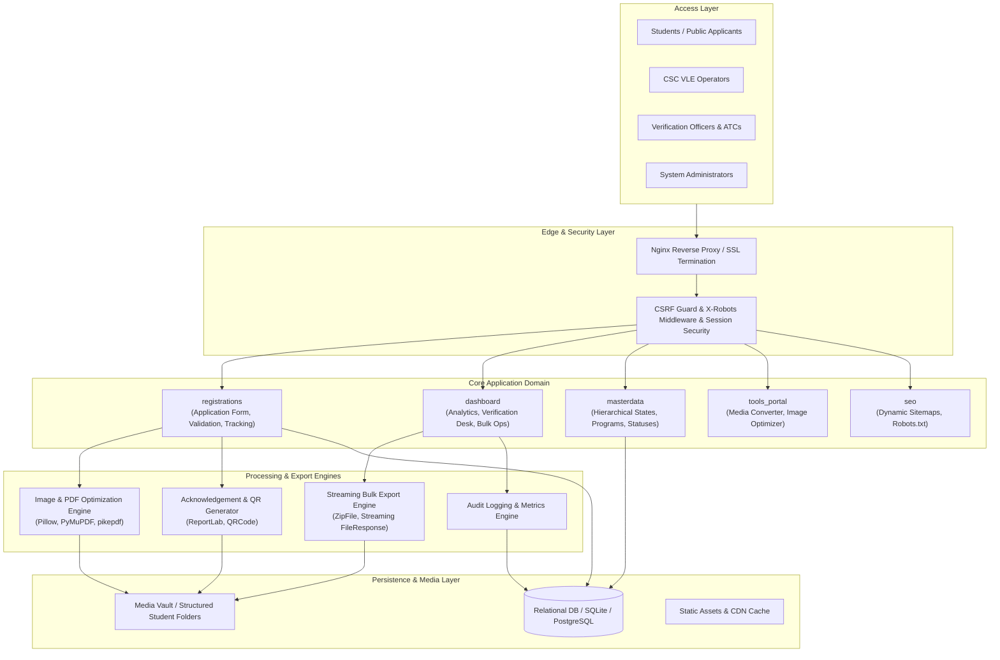

# NIELIT CSC India — Enterprise Student Registration & Lifecycle Management Platform

[](https://www.python.org/)
[](https://www.djangoproject.com/)
[](https://nielit.cscindia.org.in/)
[](#system-architecture)
[](#security--governance)
[](#testing--quality-assurance)

> **Enterprise-grade enrollment, automated image/document optimization, verification desk, and lifecycle analytics platform engineered for the National Institute of Electronics & Information Technology (NIELIT) and CSC e-Governance Services India.**

---

## 📋 Table of Contents

- [Executive Summary](#executive-summary)
- [System Architecture](#system-architecture)
- [Core Functional Modules](#core-functional-modules)
  - [1. Student Registration & Admission Gateway](#1-student-registration--admission-gateway)
  - [2. High-Performance Document Processing Pipeline](#2-high-performance-document-processing-pipeline)
  - [3. Enterprise Verification Desk & Audit Trail](#3-enterprise-verification-desk--audit-trail)
  - [4. Student Bulk Operations Engine](#4-student-bulk-operations-engine)
  - [5. Master Data Management System](#5-master-data-management-system)
  - [6. Digital Tools & Media Conversion Portal](#6-digital-tools--media-conversion-portal)
- [Technology Ecosystem](#technology-ecosystem)
- [Repository Topology](#repository-topology)
- [Installation & Local Setup](#installation--local-setup)
- [Configuration & Environment](#configuration--environment)
- [Security & Compliance](#security--compliance)
- [Testing & Quality Assurance](#testing--quality-assurance)
- [Production Deployment Runbook](#production-deployment-runbook)
- [API & Route Directory](#api--route-directory)
- [License & Support](#license--support)

---

## Executive Summary

The **NIELIT CSC India Platform** provides an integrated digital infrastructure connecting applicants, Village Level Entrepreneurs (VLEs), Authorised Training Centers (ATCs), and central administrators. It automates candidate enrollment into certified technology programs, enforces strict document dimension and file-size compliance through multi-pass algorithmic compression, provides real-time verification dashboards, and facilitates large-scale administrative operations with streaming bulk exports.

---

## System Architecture



---

## Core Functional Modules

### 1. Student Registration & Admission Gateway
- **Multi-Section Dynamic Forms**: Capture personal identifiers, educational qualifications, communication coordinates, and program choices.
- **Aadhaar Validation & Verification**: Enforces 12-digit format integrity with Luhn/Verhoeff validation checks and server-side duplicate prevention.
- **Automated Application Numbering**: Generates serialized, institutional application IDs (e.g., `CSC202600609`).
- **Cryptographic QR Acknowledgements**: Dynamic PDF and rasterized image receipts embedded with signed QR codes for immediate verification.
- **Draft & Resumption Mechanism**: Transparent autosave allowing applicants to resume and track submissions without losing state.

### 2. High-Performance Document Processing Pipeline
- **Multi-Pass Compression**: Algorithms optimize photos, signatures, thumb impressions, and certificates to comply with strict government file-size ceilings (e.g., `< 50 KB`) while preventing compression artifacts.
- **Dual-Stream Storage**: Persists both the bit-for-bit `original_file` (for legal archiving) and the web-optimized `compressed_file` (for fast rendering and processing).
- **Format Normalization**: Ingests JPEG, PNG, and PDF documents, standardizing color spaces, DPI, and orientation.

### 3. Enterprise Verification Desk & Audit Trail
- **Stage Gates**: Multi-tier application statuses (`DRAFT`, `SUBMITTED`, `VERIFIED`, `APPROVED`, `REJECTED`, `CORRECTION`).
- **Side-by-Side Document Inspection**: Review original vs. compressed uploads with high-resolution pan-and-zoom inspection.
- **Correction Ticketing**: Allows verification officers to flag specific discrepancies and issue email-notified correction workflows to candidates.
- **Immutable Audit Logs**: Records administrative actions with actor IDs, client IP addresses, timestamps, and target records.

### 4. Student Bulk Operations Engine
Located at `/dashboard/students/bulk-operations/`, this mission-critical subsystem allows administrators to perform batch actions on one, hundreds, or thousands of student records:
- **Download Documents**: Packages complete dossier archives structured as:
  ```text
  CSC_Selected_Documents/
  └── <APPLICATION_NUMBER>/
      ├── Passport_Photo/ (original + optimized)
      ├── Signature/ (original + optimized)
      └── Acknowledgement.pdf
  ```
- **Download Compressed Files**: Generates targeted, lightweight archives containing **only** optimized assets, excluding uncompressed files and omitting missing documents safely without aborting:
  ```text
  CSC_Selected_Documents/
  └── <APPLICATION_NUMBER>/
      ├── Passport_Photo/optimized.jpg
      ├── Signature/optimized.png
      └── Aadhaar/optimized.pdf
  ```
- **Batch Metadata Assignment**: Mass-assign Training Partners (ATCs) and dynamic Batch Codes with cascading UI filters.
- **Bulk Status Modification & Notifications**: Instant transition across review states with integrated batch email dispatch.
- **Enterprise Formats**: Native `.xlsx` (OpenPyXL) and `.csv` streaming with automated sanitization.

### 5. Master Data Management System
- Hierarchical state, district, and regional territory mappings.
- Curated course catalogues, eligibility requirements, and program codes.
- Administrative classification matrices (Community categories, Religions, Special categories).

### 6. Digital Tools & Media Conversion Portal
- Client-facing and administrative self-service utilities located under `/tools/`.
- On-the-fly photo dimension scaling (e.g., 3.5cm x 4.5cm), DPI normalization (200/300 DPI), signature thresholding, and PDF compression.

---

## Technology Ecosystem

| Component | Technology | Role |
| :--- | :--- | :--- |
| **Framework** | Django 4.2 / 5.0+ | Core application runtime, ORM, authentication |
| **Language** | Python 3.11 - 3.13 | High-concurrency backend logic |
| **Database** | SQLite (Dev) / PostgreSQL (Prod) | ACID-compliant transactional persistence |
| **Document Processing** | Pillow, PyMuPDF (`fitz`), pikepdf, ReportLab | Image compression, PDF generation, OCR normalization |
| **Data & Spreadsheet Engine** | Pandas, OpenPyXL | High-throughput tabular exports and reporting |
| **Frontend Architecture** | HTML5, Vanilla JavaScript (ES6+), CSS3 | Clean UI, zero heavy JS framework dependencies |
| **Design System** | Bootstrap 5, Material Icons Round | Responsive layout, dark/light compatibility |
| **WSGI / Web Server** | Gunicorn, Nginx | Production reverse proxy, static caching, TLS 1.3 |

---

## Repository Topology

```text
NIELIT_FINAL/
├── accounts/                  # Authentication, login handlers, and credentials
├── backend/                   # Low-level service adapters and processing hooks
├── config/                    # Global Django settings, root URLs, middleware
│   ├── middleware.py          # Security, header, and bot control middleware
│   ├── settings.py            # Unified settings (dev & prod)
│   ├── urls.py                # Top-level URL routing
│   └── wsgi.py                # WSGI application entry point
├── dashboard/                 # Administrative dashboard & analytics
│   ├── templates/dashboard/   # Dashboard views (bulk ops, student directory)
│   ├── views.py               # Bulk operations, export engines, analytics
│   ├── urls.py                # Dashboard route definitions
│   └── tests.py               # Comprehensive dashboard automated tests
├── exports/                   # Standalone ZIP and Excel export generators
├── masterdata/                # Hierarchical master models (States, Programs, Statuses)
├── media/                     # Managed student uploads and generated documents
├── registrations/             # Public student registration workflow & models
│   ├── models.py              # StudentApplication, UploadedDocument schemas
│   ├── views.py               # Form handling, autosave, QR generation
│   └── urls.py                # Public registration endpoints
├── static/                    # Global stylesheets, brand assets, client scripts
├── tools/ & tools_portal/     # Media conversion toolkit and processing APIs
├── utilities/                 # Image optimizer, folder manager, PDF generators
│   ├── folder_manager.py      # Secure student directory naming conventions
│   ├── image_optimizer.py     # Pillow & PyMuPDF compression engine
│   └── export_generator.py    # Large-scale export logic
├── logs/                      # Structured error and audit logs
├── manage.py                  # Django management utility
└── requirements.txt           # Verified production dependencies
```

---

## Installation & Local Setup

### 1. Prerequisites
- **Python**: Version `3.11` or higher
- **Git**: Installed and configured
- **Virtual Environment Tool**: `venv` or `virtualenv`

### 2. Clone & Environment Initialization
```bash
# Clone the repository
git clone https://github.com/your-org/nielit-portal.git
cd nielit-portal

# Create an isolated virtual environment
python -m venv .venv

# Activate the virtual environment
# Windows (PowerShell):
.venv\Scripts\Activate.ps1
# Linux / macOS:
source .venv/bin/activate
```

### 3. Install Dependencies
```bash
pip install --upgrade pip
pip install -r requirements.txt
```

### 4. Database Setup & Migrations
```bash
# Apply migrations across all apps
python manage.py makemigrations
python manage.py migrate
```

### 5. Seed Baseline Master Data
Populate institutional programs, states, districts, and status values:
```bash
python populate_master_data.py
python seed_educational_data.py
python seed_occupations.py
```

### 6. Create Administrative Credentials
```bash
python manage.py createsuperuser
```

### 7. Launch Development Server
```bash
python manage.py runserver 127.0.0.1:8000
```
- **Public Portal**: [http://127.0.0.1:8000/](http://127.0.0.1:8000/)
- **Staff Dashboard**: [http://127.0.0.1:8000/dashboard/](http://127.0.0.1:8000/dashboard/)
- **Admin Control Panel**: [http://127.0.0.1:8000/admin/](http://127.0.0.1:8000/admin/)

---

## Configuration & Environment

Create a `.env` file in the project root to configure runtime parameters:

```ini
# Environment
DJANGO_ENVIRONMENT=production
DEBUG=False
SECRET_KEY=generate-a-strong-random-key-for-production

# Hostnames & Origins
ALLOWED_HOSTS=nielit.cscindia.org.in,127.0.0.1,localhost
SITE_URL=https://nielit.cscindia.org.in
CSRF_TRUSTED_ORIGINS=https://nielit.cscindia.org.in
CORS_ALLOWED_ORIGINS=https://nielit.cscindia.org.in

# Database (Production PostgreSQL Option)
# DB_ENGINE=django.db.backends.postgresql
# DB_NAME=nielit_db
# DB_USER=nielit_user
# DB_PASSWORD=secure_password
# DB_HOST=127.0.0.1
# DB_PORT=5432

# Storage Limits
DATA_UPLOAD_MAX_MEMORY_SIZE=26214400 # 25 MB
FILE_UPLOAD_MAX_MEMORY_SIZE=26214400
```

---

## Security & Compliance

- **PII Privacy & Aadhaar Masking**: Aadhaar numbers are stored securely and automatically masked (`********1234`) across list displays and unprivileged views.
- **Arbitrary File Traversal Protection**: Document archives generate sanitized names using explicit category mappings (`safe_name()`) and never evaluate untrusted client-supplied filesystem paths.
- **Role-Based Access Control (RBAC)**: All dashboard and bulk operations require active authentication and staff permission checks (`@login_required`, `@user_passes_test(lambda u: u.is_staff)`).
- **CSRF & SSL Forwarding**: All state-modifying requests require CSRF verification with strict `HTTP_X_FORWARDED_PROTO` SSL proxy header support.
- **Audit Logging**: Mass actions, downloads, status updates, and correction tickets create persistent `AuditLog` records with user, IP, and target identifiers.

---

## Testing & Quality Assurance

The platform includes automated unit and integration tests covering the document pipeline, download packaging, and security enforcement:

```bash
# Execute the test suite
python manage.py test dashboard.tests

# Run tests across all applications
python manage.py test
```

### Verified Test Cases
- ✅ **Single Student Compressed Archive**: Packages only optimized documents in the correct institutional folder hierarchy.
- ✅ **Multi-Student Batch Archive**: Verifies archive integrity across multiple student dossiers.
- ✅ **Existing Download Preservation**: Confirms that original + compressed downloads remain unmodified.
- ✅ **Missing File Resilience**: Verifies that absent compressed files skip cleanly without falling back to original assets.
- ✅ **Access Control Checks**: Ensures unauthenticated or non-staff requests are blocked.

---

## Production Deployment Runbook

### Gunicorn Systemd Service (`/etc/systemd/system/nielit.service`)
```ini
[Unit]
Description=NIELIT CSC India Gunicorn Daemon
After=network.target

[Service]
User=www-data
Group=www-data
WorkingDirectory=/var/www/nielit
ExecStart=/var/www/nielit/.venv/bin/gunicorn \
          --workers 4 \
          --threads 2 \
          --bind unix:/run/nielit.sock \
          --timeout 120 \
          config.wsgi:application

[Install]
WantedBy=multi-user.target
```

### Nginx Virtual Host (`/etc/nginx/sites-available/nielit.conf`)
```nginx
server {
    listen 80;
    server_name nielit.cscindia.org.in;
    return 301 https://$host$request_uri;
}

server {
    listen 443 ssl http2;
    server_name nielit.cscindia.org.in;

    ssl_certificate /etc/letsencrypt/live/nielit.cscindia.org.in/fullchain.pem;
    ssl_certificate_key /etc/letsencrypt/live/nielit.cscindia.org.in/privkey.pem;

    client_max_body_size 30M;

    location /static/ {
        alias /var/www/nielit/staticfiles/;
        expires 30d;
        add_header Cache-Control "public, no-transform";
    }

    location /media/ {
        alias /var/www/nielit/media/;
        expires 7d;
        add_header Cache-Control "private";
    }

    location / {
        include proxy_params;
        proxy_pass http://unix:/run/nielit.sock;
        proxy_set_header X-Forwarded-Proto https;
    }
}
```

---

## API & Route Directory

| Route | Method | Access | Description |
| :--- | :--- | :--- | :--- |
| `/` | `GET`, `POST` | Public | Student admission registration form |
| `/tracking/` | `GET`, `POST` | Public | Application status search & acknowledgement reprint |
| `/dashboard/` | `GET` | Staff | Executive analytics and operational KPI desk |
| `/dashboard/students/` | `GET` | Staff | Searchable student directory with demographic filters |
| `/dashboard/students/bulk-operations/` | `GET` | Staff | Centralized bulk operations workplace |
| `.../download/documents/` | `POST` | Staff | Streams full ZIP archive (Original + Optimized) |
| `.../download/compressed-files/` | `POST` | Staff | Streams compressed-only ZIP archive |
| `.../export/csv/` | `POST` | Staff | Exports selected student records to CSV |
| `.../export/excel/` | `POST` | Staff | Exports selected student records to Excel (`.xlsx`) |
| `.../change-status/` | `POST` | Staff | Batch-updates application verification status |
| `.../assign-training-partner/` | `POST` | Staff | Batch-assigns Training Partner (ATC) |
| `.../assign-batch-code/` | `POST` | Staff | Batch-assigns certified course Batch Code |
| `.../request-correction/` | `POST` | Staff | Flags applications for candidate revision |
| `/tools/` | `GET` | Public/Staff | Image optimization & document converter portal |
| `/admin/` | `GET`, `POST` | Superuser | Native Django administrative interface |

---

## License & Support

- **Proprietary & Confidential**: Developed for internal deployment under the NIELIT & CSC e-Governance institutional partnership.
- **Technical Inquiries**: Direct inquiries to the institutional systems administration team.
- **Operational Portal**: [https://nielit.cscindia.org.in/](https://nielit.cscindia.org.in/)
